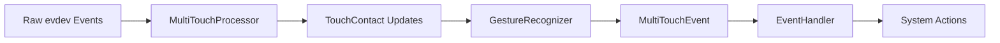

# Magic Mouse Gesture Recognition - Architecture Documentation

## Overview

The Magic Mouse Gesture Recognition system is a Rust-based application that provides multi-touch gesture recognition for Apple Magic Mouse devices on Linux. The system follows a modular, event-driven architecture built on top of the Linux evdev subsystem and the [Multi-Touch Protocol Type B](https://www.kernel.org/doc/Documentation/input/multi-touch-protocol.txt).

## System Architecture

```
┌─────────────────┐    ┌──────────────────┐    ┌─────────────────┐
│   Magic Mouse   │────│  Linux Kernel    │────│  evdev Events  │
│     Hardware    │    │  hid-magicmouse  │    │  (/dev/input)   │
└─────────────────┘    └──────────────────┘    └─────────────────┘
                                                         │
                                                         ▼
┌─────────────────────────────────────────────────────────────────┐
│                    Application Layer                            │
├─────────────────┬──────────────────┬─────────────────────────────┤
│   Device        │   MultiTouch     │   Gesture                   │
│   Management    │   Processing     │   Recognition               │
│   (device.rs)   │   (multitouch.rs)│   (gesture.rs)              │
└─────────────────┴──────────────────┴─────────────────────────────┘
                                                         │
                                                         ▼
┌─────────────────────────────────────────────────────────────────┐
│                  Event Handling                                 │
│                 (event_handler.rs)                              │
└─────────────────────────────────────────────────────────────────┘
                                                         │
                                                         ▼
┌─────────────────────────────────────────────────────────────────┐
│               System Actions (xdotool, commands)               │
└─────────────────────────────────────────────────────────────────┘
```

## Data Flow

### 1. Input Processing Pipeline



### 2. Event Processing Sequence

1. **Device Layer**: Raw input events from `/dev/input/eventX`
2. **Protocol Layer**: Multi-touch protocol parsing and contact tracking
3. **Recognition Layer**: Gesture pattern analysis and classification
4. **Action Layer**: Command execution and system integration

### 3. Async Event Handling

The system uses asynchronous programming to achieve high-performance, non-blocking event processing. This design choice is critical for several reasons:

#### Why Async Architecture?

1. **Non-blocking I/O**: Device event reading doesn't block the main processing thread
2. **Concurrency**: Multiple operations can run simultaneously without thread overhead
3. **Responsiveness**: Gesture recognition remains responsive even during heavy system load
4. **Resource Efficiency**: Single-threaded async is more memory-efficient than multi-threading
5. **Latency Optimization**: Minimizes delay between touch input and system action execution

#### Implementation Details

```rust
// Device reading (async task) - Runs independently
tokio::spawn(async move {
    loop {
        match device.fetch_events() {
            Ok(events) => {
                for event in events {
                    // Non-blocking send to processing pipeline
                    tx.send(event).await;
                }
            }
        }
    }
});

// Main processing loop - Processes events as they arrive
while let Some(event) = rx.recv().await {
    // Async processing allows other tasks to run during computation
    if let Some(mt_events) = mt_processor.process_event(event).await {
        for mt_event in mt_events {
            // Action execution doesn't block event processing
            event_handler.handle_multitouch_event(mt_event).await;
        }
    }
}
```

#### Performance Benefits

- **Low Latency**: Sub-millisecond event processing through async pipelines
- **High Throughput**: Can handle high-frequency touch events (up to 120Hz from Magic Mouse)
- **System Integration**: Non-blocking command execution via `tokio::process::Command`
- **Graceful Backpressure**: Channel-based communication handles event bursts effectively

## Configuration and Extensibility

### Gesture Customization
All gesture parameters are configurable through JSON:
```json
{
  "gesture": {
    "two_finger_tap_timeout_ms": 250,
    "two_finger_tap_distance_threshold": 100.0,
    "contact_pressure_threshold": 50.0
  }
}
```

### Action Mapping
Flexible action configuration:
```json
{
  "actions": {
    "tap_2finger": "right_click",
    "swipe_left_2finger": "xdotool key alt+Right",
    "swipe_up_2finger": "xdotool key ctrl+t"
  }
}
```

## Dependencies and Integration

### Core Dependencies
- **evdev**: Linux input device interface
- **tokio**: Async runtime and utilities
- **serde/serde_json**: Configuration serialization
- **nalgebra**: Mathematical computations (future use)

### System Integration
- **Linux Input Subsystem**: Direct evdev access
- **xdotool**: X11 window system integration
- **systemd**: Service management capability

### Hardware Requirements
- Apple Magic Mouse 2 USB-C 2024
- Linux kernel with `hid-magicmouse` module
- evdev-compatible input subsystem

## Performance Characteristics

### Memory Usage
- Bounded contact history (configurable size)
- Fixed-size data structures
- Minimal heap allocations in hot paths

### CPU Usage
- Event-driven processing (no polling)
- Async I/O for non-blocking operations
- Efficient geometric calculations

### Latency
- Sub-millisecond event processing
- Direct evdev access (no middleware)
- Optimized gesture recognition algorithms
