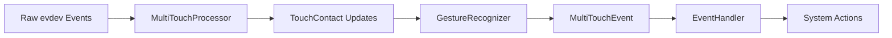

# Magic Mouse Gesture Recognition - Architecture Documentation

## Overview

The Magic Mouse Gesture Recognition system is a Rust-based application that provides multi-touch gesture recognition for Apple Magic Mouse devices on Linux. The system follows a modular, event-driven architecture built on top of the Linux evdev subsystem and the [Multi-Touch Protocol Type B](https://www.kernel.org/doc/Documentation/input/multi-touch-protocol.txt).

## System Architecture

```
┌─────────────────┐    ┌──────────────────┐    ┌─────────────────┐
│   Magic Mouse   │────│  Linux Kernel    │────│  evdev Events  │
│     Hardware    │    │  hid-magicmouse  │    │  (/dev/input)   │
└─────────────────┘    └──────────────────┘    └─────────────────┘
                                                         │
                                                         ▼
┌─────────────────────────────────────────────────────────────────┐
│                    Application Layer                            │
├─────────────────┬──────────────────┬─────────────────────────────┤
│   Device        │   MultiTouch     │   Gesture                   │
│   Management    │   Processing     │   Recognition               │
│   (device.rs)   │   (multitouch.rs)│   (gesture.rs)              │
└─────────────────┴──────────────────┴─────────────────────────────┘
                                                         │
                                                         ▼
┌─────────────────────────────────────────────────────────────────┐
│                  Event Handling                                 │
│                 (event_handler.rs)                              │
└─────────────────────────────────────────────────────────────────┘
                                                         │
                                                         ▼
┌─────────────────────────────────────────────────────────────────┐
│               System Actions (xdotool, commands)               │
└─────────────────────────────────────────────────────────────────┘
```

## Data Flow

### 1. Input Processing Pipeline



### 2. Event Processing Sequence

1. **Device Layer**: Raw input events from `/dev/input/eventX`
2. **Protocol Layer**: Multi-touch protocol parsing and contact tracking
3. **Recognition Layer**: Gesture pattern analysis and classification
4. **Action Layer**: Command execution and system integration

### 3. Async Event Handling

The system uses asynchronous programming to achieve high-performance, non-blocking event processing. This design choice is critical for several reasons:

#### Why Async Architecture?

1. **Non-blocking I/O**: Device event reading doesn't block the main processing thread
2. **Concurrency**: Multiple operations can run simultaneously without thread overhead
3. **Responsiveness**: Gesture recognition remains responsive even during heavy system load
4. **Resource Efficiency**: Single-threaded async is more memory-efficient than multi-threading
5. **Latency Optimization**: Minimizes delay between touch input and system action execution

#### Implementation Details

```rust
// Device reading (async task) - Runs independently
tokio::spawn(async move {
    loop {
        match device.fetch_events() {
            Ok(events) => {
                for event in events {
                    // Non-blocking send to processing pipeline
                    tx.send(event).await;
                }
            }
        }
    }
});

// Main processing loop - Processes events as they arrive
while let Some(event) = rx.recv().await {
    // Async processing allows other tasks to run during computation
    if let Some(mt_events) = mt_processor.process_event(event).await {
        for mt_event in mt_events {
            // Action execution doesn't block event processing
            event_handler.handle_multitouch_event(mt_event).await;
        }
    }
}
```

#### Performance Benefits

- **Low Latency**: Sub-millisecond event processing through async pipelines
- **High Throughput**: Can handle high-frequency touch events (up to 120Hz from Magic Mouse)
- **System Integration**: Non-blocking command execution via `tokio::process::Command`
- **Graceful Backpressure**: Channel-based communication handles event bursts effectively

## Configuration and Extensibility

### Gesture Customization
All gesture parameters are configurable through JSON:
```json
{
  "gesture": {
    "two_finger_tap_timeout_ms": 250,
    "two_finger_tap_distance_threshold": 100.0,
    "contact_pressure_threshold": 50.0
  }
}
```

### Action Mapping
Flexible action configuration:
```json
{
  "actions": {
    "tap_2finger": "right_click",
    "swipe_left_2finger": "xdotool key alt+Right",
    "swipe_up_2finger": "xdotool key ctrl+t"
  }
}
```

## Dependencies and Integration

### Core Dependencies
- **evdev**: Linux input device interface
- **tokio**: Async runtime and utilities
- **serde/serde_json**: Configuration serialization
- **nalgebra**: Mathematical computations (future use)

### System Integration
- **Linux Input Subsystem**: Direct evdev access
- **xdotool**: X11 window system integration
- **systemd**: Service management capability

### Hardware Requirements
- Apple Magic Mouse 2 USB-C 2024
- Linux kernel with `hid-magicmouse` module
- evdev-compatible input subsystem

## Performance Characteristics

### Memory Usage
- Bounded contact history (configurable size)
- Fixed-size data structures
- Minimal heap allocations in hot paths

### CPU Usage
- Event-driven processing (no polling)
- Async I/O for non-blocking operations
- Efficient geometric calculations

### Latency
- Sub-millisecond event processing
- Direct evdev access (no middleware)
- Optimized gesture recognition algorithms

## Module Architecture

### Core Modules

#### 1. Device Management (`device.rs`)
**Purpose**: Hardware abstraction and event reading
- **`MagicMouseDevice`**: Main device interface
- **`find_magic_mouse_device()`**: Auto-detection functionality
- **Event Reading**: Async evdev event fetching
- **Channel Communication**: Non-blocking event distribution

**Key Components**:
```rust
pub struct MagicMouseDevice {
    device: Device,       // evdev device handle
    path: PathBuf,       // Device file path
}
```

#### 2. Multi-Touch Processing (`multitouch.rs`)
**Purpose**: Linux MT Protocol Type B implementation
- **`MultiTouchProcessor`**: Core protocol parser
- **`TouchContact`**: Contact lifecycle management
- **`MultiTouchEvent`**: High-level gesture events

**Key Components**:
```rust
pub struct MultiTouchProcessor {
    pending_contacts: HashMap<i32, TouchContact>,    // Active slots
    completed_contacts: Vec<TouchContact>,           // Gesture candidates
    active_contact_count: usize,                     // Current touch count
    current_slot: i32,                               // MT protocol slot
    gesture_recognizer: GestureRecognizer,           // Gesture analysis
    config: GestureConfig,                           // Tuning parameters
    last_sync_time: Instant,                         // Debouncing
}
```

#### 3. Gesture Recognition (`gesture.rs`)
**Purpose**: Pattern analysis and gesture classification
- **`GestureRecognizer`**: Main analysis engine
- **Tap Detection**: Single and multi-finger taps
- **Swipe Detection**: Directional movement analysis
- **Pinch Detection**: Scale factor calculation

**Algorithm Features**:
- Configurable timing thresholds
- Movement distance analysis
- Multi-contact coordination
- Pressure-based filtering

#### 4. Event Handling (`event_handler.rs`)
**Purpose**: Action execution and system integration
- **`EventHandler`**: Action dispatcher
- **Shell Command Execution**: Async command processing
- **Mouse Simulation**: Click event generation
- **Action Mapping**: Configurable gesture-to-action binding

#### 5. Configuration (`config.rs`)
**Purpose**: Runtime configuration management
- **`Config`**: Main configuration structure
- **JSON Serialization**: File-based configuration
- **Default Values**: Sensible fallback settings
- **Validation**: Parameter range checking

## Error Handling Strategy

### Error Types and Recovery

#### 1. Device Errors
- **Connection Loss**: Automatic reconnection attempts
- **Permission Denied**: Clear error messages with suggested fixes
- **Hardware Failure**: Graceful degradation

#### 2. Configuration Errors
- **Invalid JSON**: Fallback to defaults with warnings
- **Missing Files**: Auto-generation of default configuration
- **Parameter Validation**: Range checking with informative errors

#### 3. System Integration Errors
- **Command Execution Failures**: Logged warnings, continued operation
- **Missing Dependencies**: Startup validation with helpful error messages
- **Permission Issues**: Clear guidance on udev rules and user groups

### Error Propagation
```rust
// Hierarchical error handling
Device Error → MultiTouch Error → Gesture Error → Action Error
     ↓              ↓               ↓             ↓
  Reconnect    Reset State     Skip Gesture   Log Warning
```

## Testing Architecture

### Unit Testing Strategy

#### 1. Component Isolation
- **Mock evdev Events**: Synthetic input generation
- **Gesture Algorithm Testing**: Deterministic pattern validation
- **Configuration Testing**: Parameter boundary testing

#### 2. Integration Testing
- **End-to-End Flows**: Complete gesture recognition pipelines
- **Async Behavior**: Tokio test framework usage
- **Error Scenarios**: Failure mode validation

#### 3. Test Data Management
```rust
fn create_test_config() -> GestureConfig {
    GestureConfig {
        scroll_threshold: 50.0,
        swipe_threshold: 100.0,
        pinch_threshold: 0.1,
        tap_timeout_ms: 300,
        // ... test-optimized parameters
    }
}
```

### Performance Testing
- **Latency Measurements**: Event-to-action timing
- **Throughput Testing**: High-frequency event handling
- **Memory Profiling**: Leak detection and usage patterns

## Deployment Architecture

### Build Configuration
```toml
[package]
name = "mouse-gesture-recognition"
version = "0.1.0"
edition = "2021"

[dependencies]
evdev = "0.12"           # Linux input device interface
tokio = "1.0"            # Async runtime
serde = "1.0"            # Configuration serialization
anyhow = "1.0"           # Error handling
log = "0.4"              # Logging framework
clap = "4.0"             # CLI argument parsing
nalgebra = "0.33"        # Mathematical computations
```

### System Integration

#### 1. Service Management
```bash
# systemd service example
[Unit]
Description=Magic Mouse Gesture Recognition
After=multi-user.target

[Service]
Type=simple
ExecStart=/usr/local/bin/mouse-gesture-recognition --config /etc/mouse-gesture/config.json
Restart=always
User=input
Group=input

[Install]
WantedBy=multi-user.target
```

#### 2. Permission Management
```bash
# udev rule for device access
SUBSYSTEM=="input", ATTRS{name}=="*Magic Mouse*", MODE="0664", GROUP="input"
```

#### 3. Dependency Management
- **Runtime Dependencies**: xdotool, wtype, wlrctl, hyprctl
- **Kernel Modules**: hid-magicmouse
- **User Groups**: input group membership

## Security Considerations

### Access Control
- **Device Permissions**: Limited to input group
- **Command Execution**: Sandboxed shell command execution
- **Configuration Security**: Read-only configuration files

### Input Validation
- **evdev Event Validation**: Malformed event rejection
- **Configuration Sanitization**: Parameter range validation
- **Command Injection Prevention**: Safe shell command construction

### Privilege Management
- **Principle of Least Privilege**: Minimal required permissions
- **Capability-Based Security**: CAP_DAC_OVERRIDE instead of full root
- **User Space Operation**: No kernel module modifications required

## Troubleshooting and Diagnostics

### Logging Architecture
```rust
// Hierarchical logging levels
error!("Critical failures that stop operation");
warn!("Recoverable issues with degraded functionality");
info!("Important operational information");
debug!("Detailed diagnostic information");
trace!("Low-level event tracing");
```

### Diagnostic Tools

#### 1. Dependency Checker
```bash
mouse-gesture-recognition --check-deps
# Validates system requirements and reports issues
```

#### 2. Device Discovery
```bash
mouse-gesture-recognition --verbose
# Lists detected devices and capabilities
```

#### 3. Event Monitoring
```bash
# Raw event inspection
sudo evtest /dev/input/eventX

# Application-level monitoring
RUST_LOG=trace mouse-gesture-recognition --verbose
```

### Common Issues and Solutions

#### 1. Device Not Found
- **Symptoms**: "Magic Mouse device not found" error
- **Causes**: Device not paired, incorrect kernel module, permission issues
- **Solutions**: Check Bluetooth connection, load hid-magicmouse module, verify udev rules

#### 2. Gestures Not Recognized
- **Symptoms**: Touch input detected but no gesture events
- **Causes**: Threshold misconfiguration, timing issues, contact tracking problems
- **Solutions**: Adjust gesture thresholds, enable debug logging, verify multi-touch events

#### 3. Actions Not Executing
- **Symptoms**: Gestures recognized but no system response
- **Causes**: Missing dependencies, command syntax errors, permission issues
- **Solutions**: Install required tools (xdotool/wtype), validate command syntax, check user permissions

## Future Architecture Considerations

### Scalability Enhancements
- **Multi-Device Support**: Simultaneous device handling
- **Plugin Architecture**: Extensible gesture recognition
- **Network Integration**: Remote action execution

### Performance Optimizations
- **SIMD Acceleration**: Vectorized mathematical operations
- **GPU Computing**: Parallel gesture analysis
- **Memory Pool Allocation**: Reduced garbage collection overhead

### Platform Extensions
- **Wayland Native**: Direct compositor integration
- **X11 Optimization**: XInput2 protocol support
- **Cross-Platform**: macOS and Windows compatibility layers

---

This architecture documentation provides a comprehensive overview of the Magic Mouse Gesture Recognition system, covering all aspects from low-level device handling to high-level gesture recognition and system integration. The modular design ensures maintainability, testability, and extensibility while providing optimal performance for real-time gesture processing.
